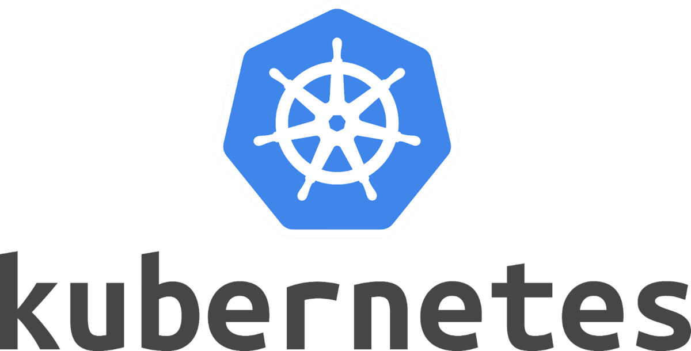
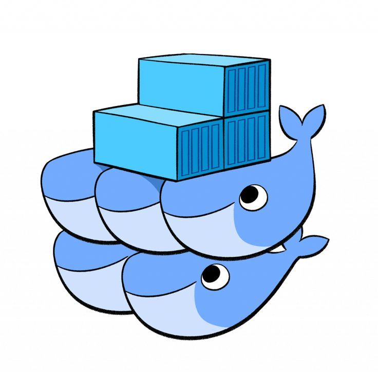

<h1>
  Container Orchestration
  Container Orchestration Tools
</h1>

**Learning objective:** By the end of this lesson, students will be able to compare and contrast self-managed and managed container orchestration tools.

## Orchestration Tools on the Market

Container orchestration tools help manage and scale containerized applications in complex environments, automating processes like container deployment, scaling, and load balancing. Different tools on the market provide varying levels of control, with some self-managed options and others fully managed by cloud providers.

Let's briefly explore both self-managed and managed orchestration tools, including their primary features and use cases.

### Self-Managed Orchestration Tools

Self-managed orchestration tools require you to install, configure, and maintain the software and underlying infrastructure. You’ll have more control over your environment but will also need to handle tasks like server maintenance, software updates, and patching.

#### Popular Self-Managed Tools

| Logo                                                                                      | Tool                                                  | Description                                                                                                                                                                                                 | Key Features                                                                            | Common Use Cases                                                                                                                |
| ----------------------------------------------------------------------------------------- | ----------------------------------------------------- | ----------------------------------------------------------------------------------------------------------------------------------------------------------------------------------------------------------- | --------------------------------------------------------------------------------------- | ------------------------------------------------------------------------------------------------------------------------------- |
|       | [Kubernetes](https://kubernetes.io/)                  | Kubernetes is one of the most widely used container orchestration platforms. Originally developed by Google, it automates deploying, scaling, and managing containerized applications. Highly customizable. | Auto-scaling, self-healing, and integration with cloud services and on-premise systems. | Large-scale deployments, multi-cloud strategies, and applications needing advanced customization or specialized configurations. |
|  | [Docker Swarm](https://docs.docker.com/engine/swarm/) | Docker Swarm is Docker’s native clustering and scheduling tool, allowing users to create and manage a swarm of Docker engines. A simpler alternative to Kubernetes.                                         | Seamless integration with Docker, quick setup, and intuitive interface.                 | Smaller setups, simpler applications, or teams already using Docker seeking lightweight orchestration.                          |
|          | [Apache Mesos](https://mesos.apache.org/)             | Apache Mesos is an open-source project capable of managing various types of workloads, from containers to Big Data applications. Supports mixed workloads.                                                  | General-purpose workload management, supports mixed workloads, and scalable.            | Organizations with mixed workloads or running large-scale data processing alongside containerized microservices.                |
|                 | [Nomad](https://www.nomadproject.io/)                 | Nomad is a lightweight and flexible scheduler for both containerized and non-containerized applications. Integrates well with other HashiCorp tools.                                                        | Simple setup, multi-cloud support, and compatibility with a variety of workload types.  | Organizations needing a multi-purpose orchestrator, especially when using HashiCorp’s ecosystem.                                |

### Managed Orchestration Tools

Managed orchestration tools, often provided by cloud vendors, relieve users of much of the infrastructure maintenance burden. These services automate setup, scaling, and basic configuration, allowing you to focus more on deploying and managing applications.

#### Popular Managed Tools

| Logo                                                                                                         | Tool                                                                         | Description                                                                                                                                                                                                            | Key Features                                                                                                         | Common Use Cases                                                                                                                 |
| ------------------------------------------------------------------------------------------------------------ | ---------------------------------------------------------------------------- | ---------------------------------------------------------------------------------------------------------------------------------------------------------------------------------------------------------------------- | -------------------------------------------------------------------------------------------------------------------- | -------------------------------------------------------------------------------------------------------------------------------- |
|                               | [Amazon Elastic Kubernetes Service (EKS)](https://aws.amazon.com/eks/)       | EKS is a managed Kubernetes service from AWS that handles the heavy lifting of managing and scaling Kubernetes clusters. AWS manages the underlying infrastructure, while users focus on deploying their applications. | Seamless AWS integration, support for hybrid and multi-cloud architectures, and node scaling automation.             | Organizations with applications on AWS, especially those already using other AWS services or building multi-cloud architectures. |
|                 | [Google Kubernetes Engine (GKE)](https://cloud.google.com/kubernetes-engine) | GKE is a fully managed Kubernetes service from Google Cloud that simplifies Kubernetes cluster management, offering advanced features like auto-scaling and Anthos for hybrid cloud.                                   | Strong integration with Google Cloud services, security enhancements, and Anthos for hybrid/multi-cloud flexibility. | Organizations heavily invested in Google Cloud or seeking advanced machine learning and analytics integrations.                  |
|  | [DigitalOcean Kubernetes](https://www.digitalocean.com/products/kubernetes/) | DigitalOcean offers a simple, cost-effective managed Kubernetes service aimed at small-to-medium-sized businesses or startups.                                                                                         | Cost-effectiveness, simplified setup and scaling, and easy integration with DigitalOcean’s cloud services.           | Small businesses and startups looking for a budget-friendly, easy-to-use Kubernetes solution.                                    |

### Additional resources

If you want to deepen your understanding of container orchestration, we recommend checking out the following resources:

- **[IBM - What is Container Orchestration?](https://www.ibm.com/cloud/learn/container-orchestration)**: An in-depth guide covering the basics and advanced concepts of container orchestration.

- **[LaunchDarkly - What Is Container Orchestration?](https://launchdarkly.com/blog/what-is-container-orchestration-exactly-everything/)**: A clear overview of container orchestration principles and how they apply to real-world scenarios.

- **[GeekFlare - 14 Container Orchestration Tools for DevOps](https://geekflare.com/container-orchestration-software/)**: A list and comparison of popular orchestration tools for DevOps teams.
