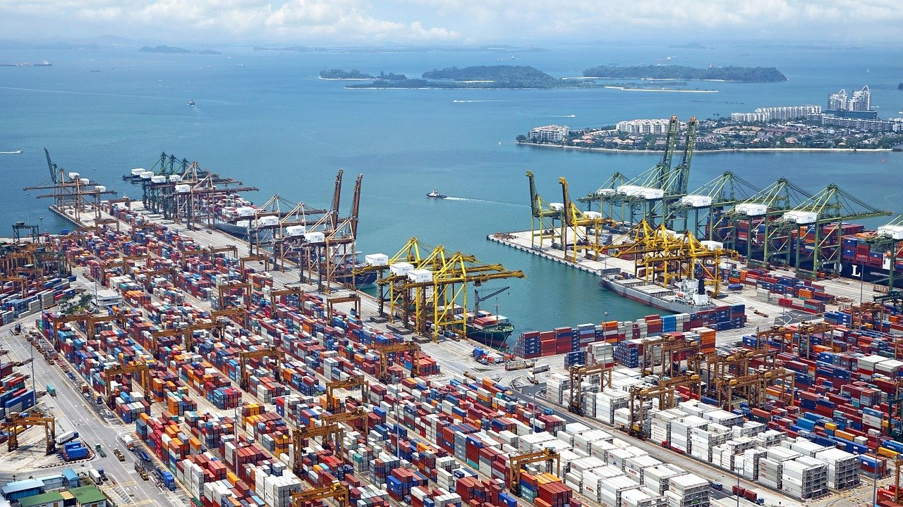

<h1>
  Container Orchestration
  How Orchestrators Manage Workloads
</h1>

**Learning objective:** By the end of this lesson, learners will be able to explain the purpose and functionality of container orchestrators and identify key components involved in orchestrating containers across multiple servers.

## How Do Container Orchestrators Work?

Imagine containerized applications as being similar to goods packed in shipping containers. Just like shipping containers make it easy to transport products efficiently by standardizing how they’re packed and moved, containers help developers package applications in a standardized way, making them easy to deploy and run across different environments.

 

 

In this analogy:

- **Containers** are the shipping containers holding the application and its dependencies.

- **Servers** are like the cargo ships carrying containers to their destinations.

However, managing these containers at a large scale requires an organized system. Here’s where **container orchestrators** come in.

### What Do Container Orchestrators Do?

Container orchestrators act like a highly automated shipping dock with cranes and logistics systems that streamline operations. They help manage, organize, and balance containers across multiple servers, ensuring the application is resilient, efficient, and scalable.

Just like a dock oversees loading and managing shipping containers, orchestrators handle many crucial tasks:

- **Organizing containers** by staging them and making sure they’re ready for deployment.

- **Loading containers onto servers** in a balanced way, so resources are used efficiently and nothing is overloaded.

- **Tracking and managing all containers** across servers, keeping a “manifest” of everything that’s running.

- **Using server space efficiently** to avoid any overloads or bottlenecks.

- **Monitoring container health**, ensuring that if one “container” (application) fails, it’s replaced without downtime.

**In short, container orchestrators manage and balance the workload of many containerized applications running across multiple servers.**

### Key Terminology

Let’s explore some essential terms in container orchestration:

| **Term**          | **Definition**                                                                                                                     |
| ----------------- | ---------------------------------------------------------------------------------------------------------------------------------- |
| **Nodes**         | Individual servers within a cluster that can run containers. Nodes provide the necessary CPU and memory for containers.            |
| **Cluster**       | A collection of nodes working together, allowing containers to run on multiple machines.                                           |
| **Scheduler**     | Decides where to place new containers within the cluster, based on available resources and existing workloads.                     |
| **Load Balancer** | Distributes incoming traffic across containers to ensure a smooth user experience and avoid overloading a single container.        |
| **Replica**       | Multiple copies of the same container, enabling the application to handle more traffic by running simultaneously across nodes.     |
| **Health Check**  | Regular monitoring to ensure each container is functioning as expected. Failed containers are restarted or replaced automatically. |

 

 

### Docker vs. Container Orchestrators

- **Docker**: Docker is a platform for creating and running containers. It packages applications with their dependencies into isolated units that can run consistently in any environment, typically on a single machine.

- **Container Orchestrators**: When you need to manage containers across multiple servers, container orchestrators automate and simplify this process. They handle deployment, scaling, resource management, and more, allowing containers to run across an entire cluster of servers.

In other words, **Docker** creates containers, while **orchestrators** manage them at scale, enabling applications to run seamlessly across large, distributed environments.

### Key Responsibilities of Container Orchestrators

With a container orchestrator, you can automate and efficiently manage:

|                              |                                                                                                                                        |
| ---------------------------- | -------------------------------------------------------------------------------------------------------------------------------------- |
| **Container Health**         | Orchestrators monitor container health and automatically replace failed containers, so applications keep running smoothly.             |
| **Load Distribution**        | They distribute containers across nodes to balance CPU and memory resources, preventing overloads.                                     |
| **Resource Management**      | Orchestrators track resource usage and alert administrators when additional nodes are needed to support demand.                        |
| **Utilization Optimization** | Orchestrators pack containers onto nodes efficiently, maximizing each server’s capacity and reducing costs by avoiding idle resources. |

 

Ultimately, Docker handles container creation and individual runtime, while a container orchestrator takes on the complexity of managing large-scale, containerized applications across a cluster.
