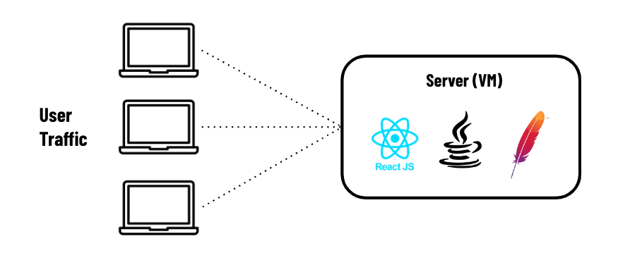
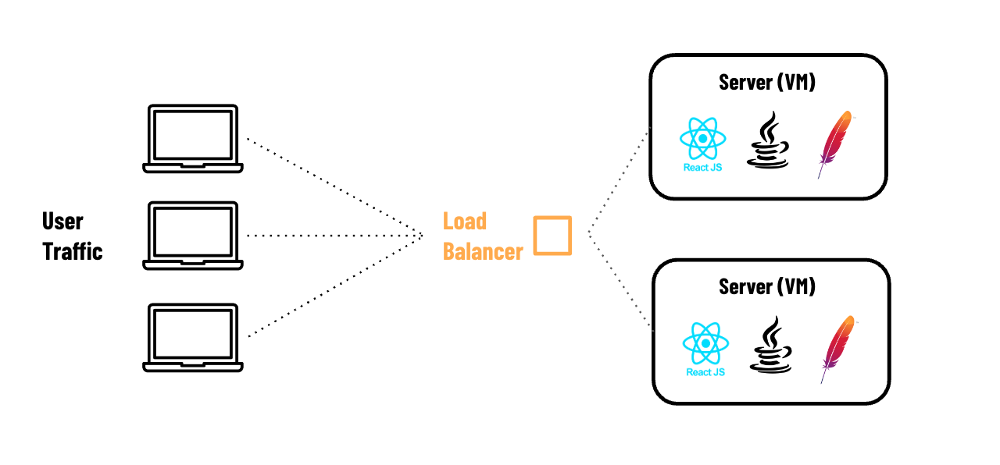
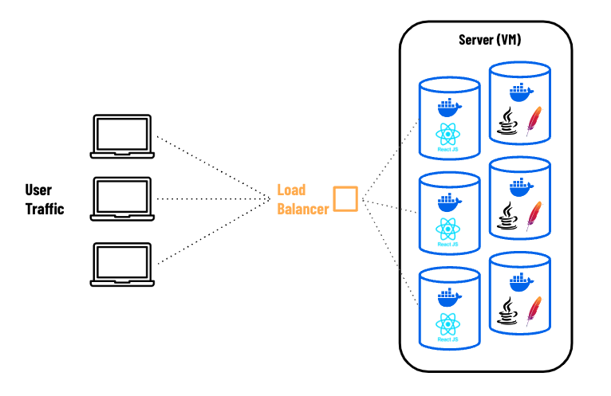
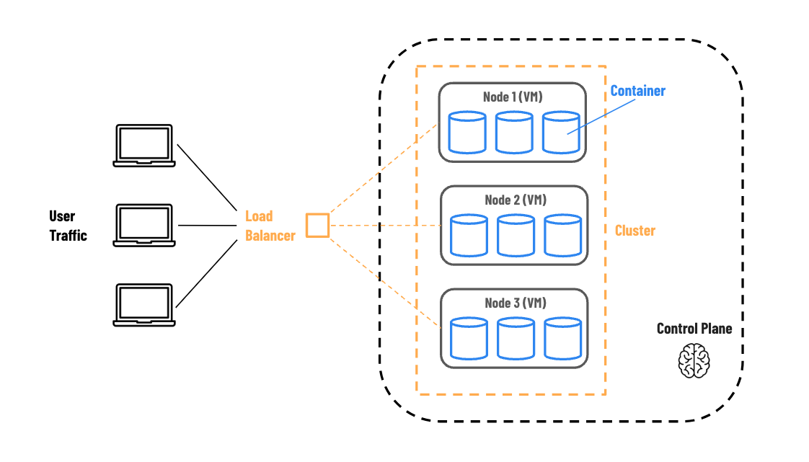

<h1>
  Container Orchestration
  Intro to Container Orchestration
</h1>

**Learning objective:** By the end of this lesson, students will be able to explain how containers enable scalable infrastructure by packaging applications into isolated, easily deployable units, and how container orchestration automates the management and scaling of these containers across multiple servers.

## Scaling with containers

In this lesson, we’ll explore how containers and container orchestration can help a business scale efficiently. Using the example of a growing small business e-commerce website, we’ll examine how containers help solve key challenges in infrastructure scaling.

## The Scenario: Scaling a small online shop

Let’s take a look at **Sarah's** story.

Sarah owns a small but growing e-commerce site that sells custom T-shirts. Her website setup includes:

- A **front-end** built with **React**.
- A **Java-based API back-end** running on an **Apache** server.
- A managed **MySQL database** storing customer and product information.

 

 

Initially, her single cloud server handled the website traffic just fine. However, as the holiday season approached, traffic increased. Pages loaded more slowly, customers faced delays, and some left without purchasing. Realizing she was losing business, Sarah knew she needed to scale her setup.

## 1. Sarah’s first attempt at scaling: adding servers manually

To handle the extra traffic, Sarah decided to add a second server. She followed some online advice and:

- Set up a new virtual machine (VM).
- Installed the necessary OS, Apache, Java, and other software
- Configured a **_load balancer_** to split traffic between the two servers

Just like that, she had doubled her capacity! Problem solved— _temporarily_.

 

 

However, this setup had limitations. Each time she needed more capacity, she would have to repeat the process for _every server_. Managing updates for Java, Apache, the OS, and other software on each machine was also time-consuming.

Realizing she’d need around **10 servers for peak traffic**, Sarah saw that manually managing this setup would be unsustainable as her business grew.

## 2. A better solution: containerizing the application

To simplify scaling, Sarah decided to **containerize** her application using **Docker**. Containers allowed her to package the app's dependencies into isolated units, eliminating the need to manage Java and Apache individually on each server.

 

 

### Advantages of containers

- With Docker, Sarah could run **multiple containers on her server**, creating a standardized environment and saving setup time

- When adding capacity, she could **easily deploy more containers** from a pre-configured server image. In the future, **adding more servers** would be straightforward as well.

- Now, she only needed to keep Docker and the server’s operating system up to date, minimizing overhead.

- The **load balancer** directed traffic to her containers, optimizing performance and making scaling easier.

### Limitations of containers

While Docker containers were an improvement, some challenges remained:

- **Reducing capacity** during quiet times was still a manual, time-consuming process.
- She was sometimes paying for **underutilized servers** during low-traffic periods.
- Sarah **couldn’t easily monitor** every container’s status, so if a container failed, traffic could still be routed to it, causing errors.

Clearly, there was still room for improvement.

## 3. The final step: setting up a container orchestrator

To address these limitations, Sarah implemented a **container orchestrator**. After researching her options, she selected a tool to automate and manage her containerized setup.

The orchestrator allowed her to scale up or down easily, automatically managing containers across servers as needed.

### Container Orchestrator Setup

 

### With an orchestrator, Sarah gained these benefits:

- The orchestrator started, monitored, and restarted containers whenever they failed, keeping everything running smoothly.
- Traffic was evenly distributed across containers, and routing adjusted automatically when containers were added or removed.
- Sarah could add servers to the cluster, and the orchestrator would deploy containers to them as needed.
- She could oversee her entire setup from one dashboard and receive alerts for any issues, like low storage or updates.

During peak traffic, Sarah could now scale up by simply instructing the orchestrator to deploy more containers, with no manual setup required.

_Scaling was now a breeze._

## Enterprise Level Scaling

Imagine applying Sarah’s story to a large enterprise with hundreds, thousands, or even tens of thousands of containers. Managing infrastructure at this scale requires a sophisticated approach, as these containers power critical applications, data processing jobs, and background tasks, each with different workloads and life cycles.

### In a large organization:

- Some containers, like web applications and APIs, need to be up **24/7** to ensure availability for users.
- Other containers may run only at specific times or when triggered, such as scheduled backups, nightly data processing jobs, or ad-hoc batch imports.

Managing this many containers, across hundreds or even thousands of virtual machines, is complex. The costs add up quickly, so it’s essential to be as efficient with compute resources as possible. Without automation, this would require a dedicated team to monitor, balance, and troubleshoot continuously.

This is where a **container orchestrator** proves invaluable. An orchestrator provides a control plane that manages all nodes in a cluster and the containers running on them. It automates crucial tasks like scaling up and down, restarting failed containers, load balancing, and optimizing resource usage across the cluster.

By centralizing and automating these tasks, the orchestrator makes it possible to manage vast, enterprise-level infrastructures with efficiency and reliability.

## Key takeaways from Sarah's story

- **Containers enable scalability**: Docker and containerization provide the foundation for scaling applications but don't handle scaling automatically.

- **Containers need organization**: Each container is a self-contained unit but requires management to function smoothly within a larger system.

- **Orchestrators simplify large-scale management**: Container orchestrators allow businesses to manage and scale thousands of containers efficiently and cost-effectively.
