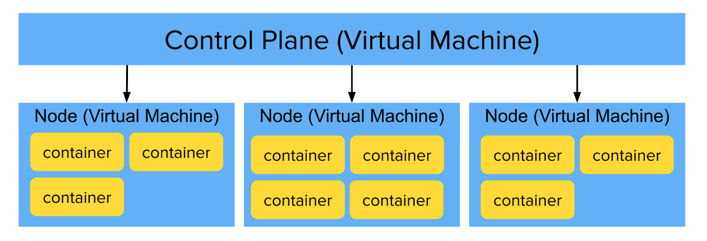

<h1>
  Container Orchestration
  Intro to Container Orchestration
</h1>

**Learning objective:** By the end of this lesson, students will be able to explain how containers enable scalable infrastructure by packaging applications into isolated, easily deployable units, and how container orchestration automates the management and scaling of these containers across multiple servers

## Scaling with Containers

In this lesson, we’ll explore how containers and container orchestration can help a business scale efficiently. Using the story of a growing small business e-commerce website, we’ll examine how containers solve key challenges in infrastructure scaling.

## An Example Scenario

Let’s take a look at Sarah's story.

Sarah owns a small but growing e-commerce site that sells custom T-shirts. Her website setup includes:

- A front-end built with React.
- A Java-based API back-end running on an Apache server.
- A managed MySQL database storing customer and product information.

 

 

At first, Sarah’s single cloud server handled her website traffic without any issues. But as the holiday season approached, traffic surged. Pages started loading slowly, customers experienced delays, and some even left the site without making a purchase. Seeing that she was losing business, Sarah knew it was time to scale her setup.

## 1. Sarah’s First Attempt at Scaling: Adding Servers Manually

To handle the extra traffic, Sarah decided to add a new server. She followed some online advice and:

- Set up a new virtual machine (VM).
- Installed the operating system, Apache, Java, and other necessary software.
- Configured a load balancer to split traffic between her two servers.

Just like that, she had doubled her capacity. Problem solved—for now.

But this manual setup had limitations. Each time she wanted more capacity, she’d have to repeat the entire process for each new server. Plus, she’d need to manage updates for Java, Apache, the OS, and other software on every machine. Doing this on top of running her business was becoming challenging.

### Scaling Up Efficiently

Sarah’s new setup kept things running smoothly for about a week, but soon enough, her site started slowing down again as demand surged. Frustrated customers were leaving without completing their purchases. Realizing she needed a long-term solution, Sarah assessed her needs and estimated she’d need **about 10 servers** to handle peak holiday traffic.

Setting up and maintaining 10 servers manually would be time-consuming and unsustainable as her business continued to grow.

## 2. A Smarter Solution: Containerizing the Application

Sarah decided to try a different approach: containerizing her application with Docker. By using Docker containers, she could package all her app's dependencies into isolated units, eliminating the need to manage Java and Apache on each server individually.

 

 

### Advantages of Containers

- With Docker, Sarah could run her containers on any server with Docker installed, creating a standardized environment that saved setup time. Now, each new server only required Docker, and she could quickly deploy her containers.

- She created a reusable server image with Docker pre-installed, so adding capacity was as easy as starting a new server from this image and deploying her containers. Once they were running, she could configure her load balancer to direct traffic accordingly. Now, she only needed to keep Docker and the OS up to date on each server—a big improvement!

### Limitations of Containers

This approach worked well initially, but there were still some drawbacks:

- **Scaling down during quiet periods** was challenging. Adjusting the load balancer and taking servers out of use was a slow, manual process.
- She was **paying for underutilized servers** during low-traffic times, which wasn’t cost-effective.
- Sarah couldn’t monitor the status of every container on each server. If a container failed, she had no way of knowing, so traffic could still be routed to it, causing errors for her customers.

Clearly, there was room for further improvement.

## 3. The Final Step: Setting Up a Container Orchestrator

After careful consideration, Sarah decided to implement a container orchestrator to manage and automate her containerized setup. She researched her options and chose a tool to orchestrate her environment, making scaling more efficient and manageable.

Now, instead of manually setting up servers and installing Docker each time she wanted to add capacity, she could simply add nodes to her cluster.

 

 

Sarah configured the orchestrator to run **10 instances** of her web application and **10 instances** of her API. The orchestrator automatically started these containers, kept them running, and even replaced any that became unresponsive.

### With an Orchestrator, Sarah Gained These Benefits:

- The orchestrator automatically started, monitored, and restarted containers whenever they failed, ensuring everything ran smoothly without Sarah needing to step in.
- Traffic was spread evenly across all containers, and the orchestrator adjusted routing whenever new containers were added or removed, enhancing load balancing.
- When additional power was needed, Sarah could simply add new virtual machines to the cluster, and the orchestrator would deploy containers on them automatically.
- Sarah could monitor her entire setup from a single dashboard and receive alerts for potential issues, such as low storage or required updates.

When traffic surged, Sarah could instruct the container orchestrator to start additional containers with a single command—no manual intervention required.

_Scaling was now a breeze._

## Scaling up: Containers at an enterprise level

Imagine applying Sarah’s story to a large enterprise with hundreds, thousands, or even tens of thousands of containers. Managing infrastructure at this scale requires a sophisticated approach, as these containers power critical applications, data processing jobs, and background tasks, each with different workloads and lifecycles.

### In a large organization:

- Some containers, like web applications and APIs, need to be up **24/7** to ensure availability for users.
- Other containers may run only at specific times or when triggered, such as scheduled backups, nightly data processing jobs, or ad-hoc batch imports.

Managing this many containers, across hundreds or even thousands of virtual machines, is complex. The costs add up quickly, so it’s essential to be as efficient with compute resources as possible. Without automation, this would require a dedicated team to monitor, balance, and troubleshoot continuously.

This is where a **container orchestrator** proves invaluable. An orchestrator provides a control plane that manages all nodes in a cluster and the containers running on them. It automates crucial tasks like scaling up and down, restarting failed containers, load balancing, and optimizing resource usage across the cluster.

 

 

By centralizing and automating these tasks, the orchestrator makes it possible to manage vast, enterprise-level infrastructures with efficiency and reliability.

## Key takeaways from Sarah's story

- **Containers enable scalability**: Docker and containerization provide the foundation for scaling applications but don't handle scaling automatically.

- **Containers need organization**: Each container is a self-contained unit but requires management to function smoothly within a larger system.

- **Orchestrators simplify large-scale management**: Container orchestrators allow businesses to manage and scale thousands of containers efficiently and cost-effectively.
