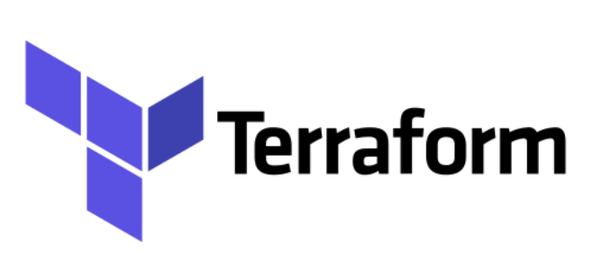
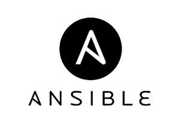

<h1>
  Container Orchestration
  Modern Server Management: Containers as Assets
</h1>

**Learning objective:** By the end of this lesson, learners will be able to describe the benefits of treating servers and containers as replaceable assets, and identify key practices for building resilient, scalable infrastructure using Infrastructure as Code (IaC).

## Treating servers as replaceable assets: The “Cattle, Not Pets” analogy

In containerized platforms, there’s a popular analogy: **treat servers like cattle, not pets**. While it may come across as harsh, it’s a commonly used phrase in the industry to convey a shift in how we approach server management in modern infrastructure.

### Traditional approach: managing servers as unique resources

In the past, organizations commonly used dedicated servers for specific applications— such as running an Apache web server. These servers were configured manually, maintained regularly, and required close attention to stay functional. When issues came up, teams would spend time troubleshooting, updating, or even rebuilding these servers from scratch. This process could be time-consuming and expensive.

> These dedicated servers are sometimes called **"snowflakes"** because each one is unique, just like a snowflake.

> In our analogy, we might call these servers **“pets”** because, like pets, they are cared for individually, kept healthy, and fixed when they break.

### Modern approach: treating servers as replaceable resources

With today’s approach, servers are often treated more like resources in a farm—standardized and ready to be replaced when needed. Using **Infrastructure as Code** (IaC) practices, teams can quickly rebuild and deploy servers with minimal effort by running automated commands, ensuring consistency across servers and saving time. Applications are now designed to be **stateless**—meaning they store important data outside of the server, in external storage or cloud services. This setup makes replacing individual servers easy, with no data loss.

In this approach, we don't focus on troubleshooting or maintaining each server individually. If a server has issues, we simply replace it with a new one.

> This is why these types of servers are sometimes called **“cattle”** in the analogy—they’re part of a large group, managed as a whole, rather than individually nurtured.

### Containers follow the same principle

Containers operate in a similar way. When a containerized application encounters issues, we don’t try to fix it directly within the container. Instead, we terminate the problematic container and start a new one based on the original container image. This approach keeps applications running smoothly without requiring time-consuming troubleshooting.

If an issue is persistent, it is usually fixed in the codebase, creating an updated container image, which is then deployed as a replacement. In a well-managed environment, systems administrators or "ops teams" rarely need to manually access a container (such as by **SSH**—securely connecting to it for troubleshooting). Instead, they rely on automated processes to see that new containers are launched as needed.

## Using Infrastructure as Code (IaC): Ansible and Terraform

When deploying containers and managing servers, [**Infrastructure as Code** (IaC)](https://www.ibm.com/topics/infrastructure-as-code) tools like **Ansible** and **Terraform** automate the setup and management of servers within a cluster. With IaC, new nodes (servers) can be added quickly to accommodate increasing demand, and existing nodes can be easily replaced.

| Logo                                                                          | Tool                                       | Description                                                                                                                                                                   |
| ----------------------------------------------------------------------------- | ------------------------------------------ | ----------------------------------------------------------------------------------------------------------------------------------------------------------------------------- |
|  | [**Terraform**](https://www.terraform.io/) | Provisions new servers (nodes) in a cluster, allowing teams to quickly add capacity when needed. It ensures consistency by deploying identical configurations across servers. |
|      | [**Ansible**](https://www.ansible.com/)    | Manages software and configuration on each server, automating tasks like updates and maintaining uniformity across all nodes.                                                 |

Together, these tools streamline server operations, making it easy to deploy, scale, and manage infrastructure with minimal manual intervention.

## Key takeaways

To make the most of containerized platforms and orchestrators, it’s important to remember a few best practices:

- **Containers should be stateless**: Applications should store essential data in secure, persistent locations outside of the container.

- **Automate replacements**: Use orchestration and IaC to replace faulty containers and servers quickly and efficiently.

- **Resilience through redundancy**: By treating servers and containers as replaceable assets, organizations create a resilient, scalable environment.

> By treating servers and containers as replaceable resources, we build systems that are both efficient and reliable, able to scale up or down as needed without risk of data loss.
